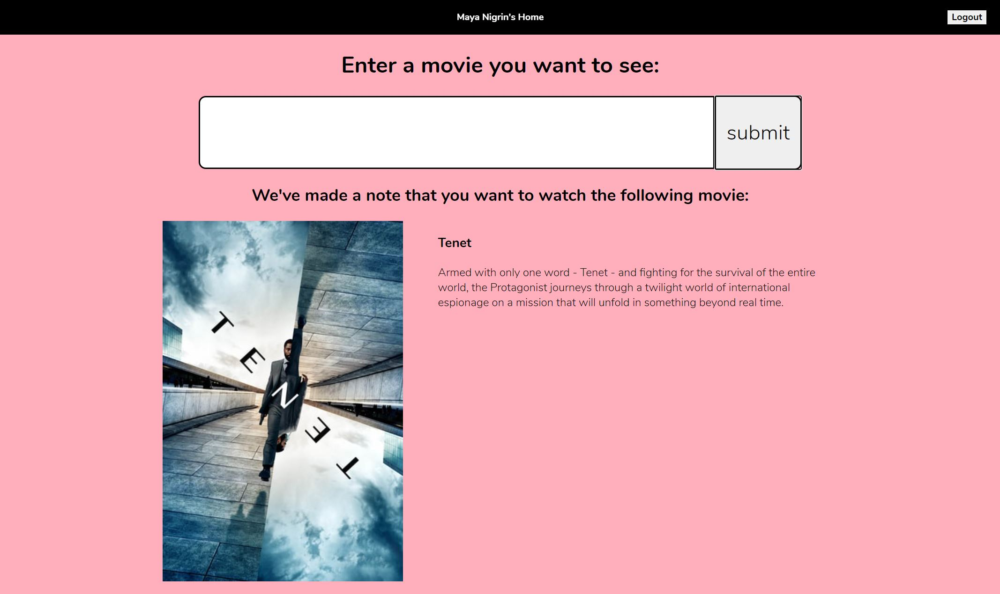

# Movie Findr

Made for HackMIT 2020, this app will help you find which movies to watch with your friends! Test it out for yourself at http://moviefindr.ddns.net/

## How it Works

When you go to Movie Findr, you will be asked to log in either by entering a username of your choice, or by logging in with Facebook.

After that, there are 3 features that you can use: Upload, Swipe, or Compare. The first of these, Upload, is perfect if you already have a movie in mind that you know you want to watch. Click the Upload panel, and enter the name of your movie. If we can find it, we'll all it to your list!

If you don't have a movie in mind, you can instead go to Swipe, which will show you a variety of popular movies one at a time, and you just click a button on each one to let us know if you want to watch it or not!

Finally, once you'd added a couple movies to your "want to watch" list, head over to Compare to see which movies you and friends have in common! Before you enter any friends, the list will just show movies that you've indicated you want to watch. Once you enter a username (or more!) into the input at the top, though, the list will be refined to show only movies that you all want to watch! You can easily add or remove friends from the comparison by typing their name into the input box and submitting to add them, or by hitting the 'x' next to their box to remove them.

## How it's Made

This web app uses a combination of languages, frameworks, and tools. For the backend we're using Python and Django with a SQLite database. We designed a data model and API contract, and implemented that along with some other services and views that would be useful. For the frontend, we created a React app and used HTML and CSS to make everything look presentable. We also used a Facebook Login node module to allow users to log in via Facebook.

## What comes next?

Some things we'd like to add to this project if we have more time are adding in TV shows, allowing users to filter by genre when comparing, allowing users to choose friends from their Facebook friends list when comparing, allowing users to filter by availability on different streaming services, and allowing users to remove a movie from their Liked list.

## Credit

This project would not be possible without [The Movie Database](https://www.themoviedb.org/)'s free API!!
